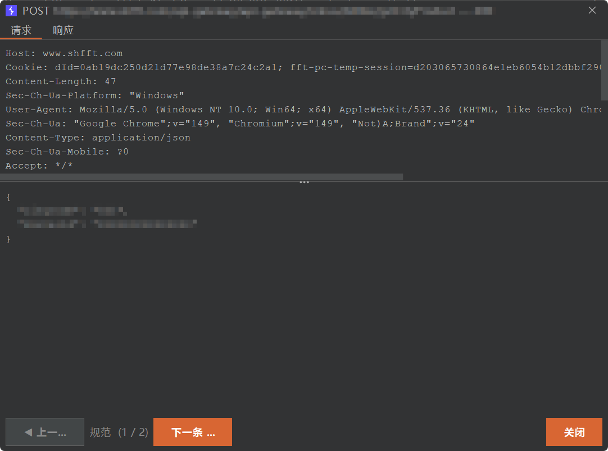
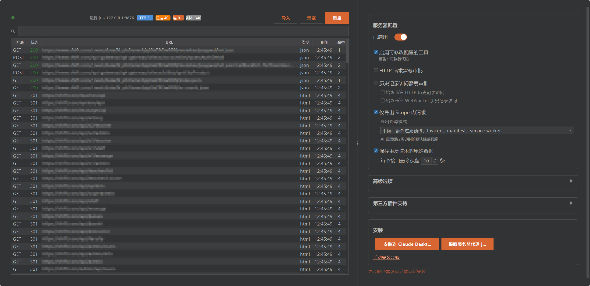

# Burp Suite MCP Server -- 魔改增强版

[中文](#中文) | [English](#english)

---

<a id="中文"></a>

# Burp Suite MCP Server -- 魔改增强版

**给 Burp 装上一个真正能长期稳定工作的 MCP 服务。**

如果你遇到过这些问题，这个版本就是为你准备的：

- AI 客户端隔几分钟就断开，反复重连
- Burp 历史记录一多就卡，甚至直接假死
- 大响应、大量历史、扫描结果根本不好查
- 官方版能跑 demo，但扛不住真实渗透测试场景

这个仓库是基于 PortSwigger 官方 [mcp-server](https://github.com/PortSwigger/mcp-server) 的深度增强版，核心目标很直接：

1. 先让它稳定可用
2. 再让它适合真实工作流
3. 最后把使用门槛降到足够低

## 先看怎么用

### 1. 构建

前提：

- Java 21+
- 本机可用 `jar`

```bash
git clone https://github.com/llc141525/burp-mcp-enhance.git
cd burp-mcp-enhance
./gradlew embedProxyJar
```

构建完成后，产物在：

```text
build/libs/burp-mcp-all.jar
```

### 2. 加载到 Burp

1. 打开 Burp Suite
2. 进入 `Extensions`
3. `Add` -> `Extension Type = Java`
4. 选择 `build/libs/burp-mcp-all.jar`
5. 加载后，在 Burp 的 MCP 面板启用服务

### 3. 连接你的 AI 客户端

服务默认监听：

```text
http://127.0.0.1:9876/mcp
```

推荐使用 Streamable HTTP：

```json
{
  "mcpServers": {
    "burp": {
      "type": "http",
      "url": "http://127.0.0.1:9876/mcp"
    }
  }
}
```

适用于 Claude Desktop、Cursor 以及其他支持 Streamable HTTP 的 MCP 客户端。

### 4. 如果客户端只支持 stdio

这个项目内置 `mcp-proxy-all.jar`，可以桥接 stdio：

```json
{
  "mcpServers": {
    "burp": {
      "command": "java",
      "args": [
        "-jar",
        "/path/to/mcp-proxy-all.jar",
        "--sse-url",
        "http://127.0.0.1:9876/sse"
      ]
    }
  }
}
```

> 也可以在 Burp UI 里直接点击“提取服务器代理 jar”或“安装到 Claude Desktop”。

## 为什么这个版本值得用

### 1. 不再依赖脆弱的 SSE 长连接

官方版主要依赖 SSE。问题是 SSE 本来就不适合高频、长时间、工具型请求响应场景，实际表现就是：

- 心跳超时
- 长调用阻塞
- 连接被打断
- AI 端频繁重连

这个版本把主通道换成了 **Streamable HTTP（MCP 2025-03-26）**：

```text
原版： SSE ----- 保活 ----- 保活 ----- 断开
本版： POST -> 结束  POST -> 结束  POST -> 结束
```

没有长连接，自然也就没有“用着用着掉线”这个老问题。

### 2. 查询不再实时打 Burp API，Burp 不再被拖死

官方版每次查询都直接调用 Burp API。真实使用里，只要代理历史一多：

- 查历史卡
- 查细节卡
- Burp UI 卡
- 严重点直接无响应

这个版本改成了 **后台增量导出 + SQLite 本地缓存**：

```text
原版： AI 查询 -> Burp API（实时）-> Burp 卡死
本版： AI 查询 -> SQLite 缓存 -> 毫秒返回
                 ^
            后台导出器（增量同步）
                 ^
            Burp API
```

这样做的结果很直接：

- MCP 查询速度更稳定
- Burp 不会因为 AI 查询而持续卡顿
- 历史、扫描结果、详情查看都更适合长期会话

## 一眼看懂的核心能力

### 稳定性

- 默认推荐 Streamable HTTP，显著降低断连问题
- 保留 SSE 兼容模式，兼容旧客户端
- 支持重启服务，不需要反复重载扩展

### 性能

- Burp 数据后台增量同步到 SQLite
- HTTP 历史和扫描结果可分页读取
- 自动去重、自动裁剪、自动清理旧数据

### 更适合渗透测试工作流

- 支持按 ID 查看完整请求/响应详情
- 支持对比两条响应差异 `diff_proxy_responses`
- 支持 GraphQL introspection / 类型查询 / schema 缓存
- 支持范围管理、站点地图、主动扫描

### 更适合 AI 使用

- 大响应支持异步任务和文件分块读取
- `get_burp_info` 可让 AI 先理解当前 Burp 能力
- 自动审批目标支持统一管理
- 处理了常见的 `20.0` / `20` 这类类型不匹配问题

## 项目展示

### 请求详情查看

可以直接在界面里查看单条请求的请求头、请求体和结构化内容。



### 仪表板与服务配置

可以实时查看服务状态、缓存情况，并调整导出和审批行为。



## 常见使用场景

### 让 AI 查 Burp 历史

- `get_proxy_http_history`
- `get_proxy_http_detail`
- `get_proxy_websocket_history`

### 让 AI 做目标侦察

- `manage_scope`
- `get_site_map`
- `graphql_introspect`
- `graphql_list_types`
- `graphql_describe_type`

### 让 AI 帮你分析请求差异

- `diff_proxy_responses`

### 让 AI 发请求但不把 Burp 弄卡

- `send_http1_request`
- `send_http2_request`
- `submit_task`
- `get_task_result`

## MCP 工具重点速览

### HTTP 与请求操作

- `send_http1_request`
- `send_http2_request`
- `create_repeater_tab`
- `send_to_intruder`

### 代理历史与缓存

- `get_proxy_http_history`
- `get_proxy_websocket_history`
- `list_proxy_http_history`
- `get_proxy_http_detail`
- `exporter_stats`

### 范围、站点与扫描

- `manage_scope`
- `get_site_map`
- `start_active_scan`（Burp Pro）
- `list_scanner_issues`
- `get_scanner_issue_detail`

### GraphQL

- `graphql_introspect`
- `graphql_list_types`
- `graphql_describe_type`
- `graphql_query`

### 差异分析

- `diff_proxy_responses`

### 配置与辅助

- `manage_auto_approve_targets`
- `set_task_execution_engine_state`
- `set_proxy_intercept_state`
- `clear_database`
- `get_burp_info`

## 配置说明

| 选项 | 说明 | 默认值 |
|------|------|--------|
| 服务器主机 | 监听地址 | `127.0.0.1` |
| 服务器端口 | 监听端口 | `9876` |
| 严格 localhost 模式 | WSL/远程环境需关闭 | 开启 |
| 启用保活心跳 | SSE 连接保活 | 开启 |
| 保活间隔 | 心跳间隔（秒） | 30s |
| 最大响应大小 | 单次响应上限（KB） | 100KB |
| HTTP 请求审批 | 发送 HTTP 前需确认 | 开启 |
| 历史记录访问审批 | 读取历史前需确认 | 开启 |

## 详细能力说明

### SQLite 缓存层

- 代理 HTTP 历史和扫描问题自动缓存到本地 SQLite
- 支持分页查询、详情查看和按 ID 检索
- SHA-256 去重（`method + URL`），5 分钟窗口合并
- 自动清理：10 万 HTTP 记录、1 万扫描问题

### 后台导出器

- 协程驱动后台轮询，默认每 5 秒同步一次
- 游标增量同步，只拉取新数据
- 支持仅导出 Scope 内请求
- 支持导出噪音过滤策略

### 异步任务系统

- `submit_task` 提交后台任务，立即返回 ID
- `get_task_result` 轮询结果
- `read_file` / `delete_file` 管理大响应文件
- 适合大响应、长任务和低 token 压力场景

## 架构说明

```text
+---------------------------------------------------+
|                   Burp Suite                      |
|  +----------------------------------------------+ |
|  |          MCP Server Extension                | |
|  |  +------------------+  +-------------------+ | |
|  |  | POST /mcp        |  | GET+POST /sse     | | |
|  |  | (Streamable HTTP)|  | (SSE 兼容模式)    | | |
|  |  +------------------+  +-------------------+ | |
|  |  +-------------+  +-----------------------+  | |
|  |  | Exporter    |->|  SQLite Database      |  | |
|  |  | (后台同步)   |  |  (本地缓存)           |  | |
|  |  +-------------+  +-----------------------+  | |
|  +----------------------------------------------+ |
|          ^                  ^                     |
|   HTTP POST /mcp      SSE GET /sse                |
+----------+------------------+---------------------+
           |                  |
    +------+------+    +------+------+
    | MCP Client  |    | MCP Client  |
    | (Claude等)  |    | (旧版/代理) |
    +-------------+    +-------------+
```

## 构建命令

| 命令 | 说明 |
|------|------|
| `./gradlew embedProxyJar` | 构建最终可分发 JAR（推荐） |
| `./gradlew test` | 运行测试 |
| `./gradlew shadowJar` | 仅构建主 JAR |

## 开发

工具定义主要位于：

```text
src/main/kotlin/net/portswigger/mcp/tools/
```

新增工具时，创建 `@Serializable` 参数类并在 `Tools.kt` 注册即可：

```kotlin
@Serializable
data class MyToolArgs(val param: String)

mcpTool<MyToolArgs>("工具描述") {
    // your logic
}
```

---

<a id="english"></a>

# Burp Suite MCP Server -- Enhanced Edition

**A Burp MCP server that is built for real workloads, not just demos.**

This fork exists for one reason: the official server is hard to use in long-running, real penetration testing sessions.

Typical failure modes in the official build:

- AI clients disconnect repeatedly
- Burp slows down or freezes when history grows
- Large responses are painful to inspect
- Scanner results and cached data are not easy to work with

This fork fixes those issues at the architecture level.

## Quick Start

### Build

Requirements:

- Java 21+
- `jar` available on your machine

```bash
git clone https://github.com/llc141525/burp-mcp-enhance.git
cd burp-mcp-enhance
./gradlew embedProxyJar
```

Artifact:

```text
build/libs/burp-mcp-all.jar
```

### Load Into Burp

1. Open Burp Suite
2. Go to `Extensions`
3. Click `Add`
4. Choose `Extension Type = Java`
5. Select `build/libs/burp-mcp-all.jar`
6. Enable the MCP server in Burp

### Configure Your MCP Client

Recommended:

```json
{
  "mcpServers": {
    "burp": {
      "type": "http",
      "url": "http://127.0.0.1:9876/mcp"
    }
  }
}
```

For stdio-only clients:

```json
{
  "mcpServers": {
    "burp": {
      "command": "java",
      "args": [
        "-jar",
        "/path/to/mcp-proxy-all.jar",
        "--sse-url",
        "http://127.0.0.1:9876/sse"
      ]
    }
  }
}
```

## Why This Fork Matters

### Streamable HTTP instead of fragile SSE-first behavior

The official server relies on SSE for a workload that behaves much more like request-response tooling than streaming UI updates. Under load, that tends to break.

This fork makes Streamable HTTP the primary path:

```text
Official: SSE ----- keep alive ----- keep alive ----- drop
This fork: POST -> done  POST -> done  POST -> done
```

### SQLite cache instead of live-querying Burp on every request

The official design asks Burp for data in real time on every query. That becomes painful once history grows.

This fork uses a background exporter plus SQLite cache:

```text
Official: AI query -> Burp API (real-time) -> Burp freezes
This fork: AI query -> SQLite cache -> instant
                      ^
                 Background exporter
                      ^
                   Burp API
```

## Key Capabilities

- Streamable HTTP MCP endpoint
- SSE compatibility mode
- SQLite-backed cached proxy/scanner history
- Background incremental exporter
- GraphQL introspection and schema caching
- Response diffing by history ID
- Scope management and site map queries
- Async task queue for large responses
- Chinese UI and built-in control dashboard

## Screenshots

### Request Detail Review

Inspect request headers and body content in a focused detail view.


### Dashboard & Server Settings

Monitor server/cache state and adjust runtime behavior from the built-in dashboard.


## Important Tools

### HTTP

- `send_http1_request`
- `send_http2_request`
- `create_repeater_tab`
- `send_to_intruder`

### History & Cache

- `get_proxy_http_history`
- `get_proxy_websocket_history`
- `list_proxy_http_history`
- `get_proxy_http_detail`
- `exporter_stats`

### Scope & Scanning

- `manage_scope`
- `get_site_map`
- `start_active_scan`

### GraphQL

- `graphql_introspect`
- `graphql_list_types`
- `graphql_describe_type`
- `graphql_query`

### Analysis & Utilities

- `diff_proxy_responses`
- `manage_auto_approve_targets`
- `get_burp_info`

## Build Commands

| Command | Description |
|---------|-------------|
| `./gradlew embedProxyJar` | Build the distributable JAR |
| `./gradlew test` | Run tests |
| `./gradlew shadowJar` | Build the main JAR only |
